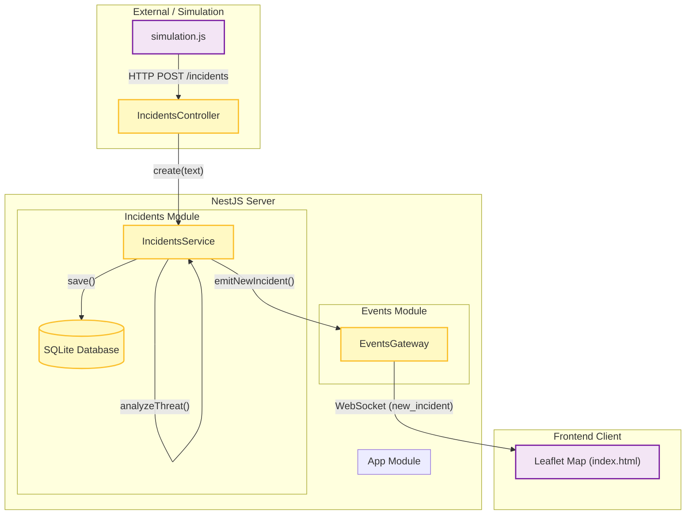

# Overwatch System Architecture

## 1. Data Flow Analysis (วิเคราะห์การไหลของข้อมูล)

กระบวนการทำงานของระบบ Overwatch จาก Simulation จนถึงการแสดงผลบนแผนที่ มีขั้นตอนดังนี้:

1.  **Simulation (`simulation.js`)**:
    - ทำหน้าที่เป็น "Sensor" จำลองสถานการณ์ (หรือรับค่าจากข้อมูลจริง)
    - สร้างข้อมูลเหตุการณ์ (JSON) ประกอบด้วยข้อความ (`text`) และพิกัด (`lat`, `lng`)
    - ส่งข้อมูลผ่าน **HTTP POST** ไปยัง API Endpoint: `http://localhost:3000/incidents`

2.  **API Layer (`IncidentsController`)**:
    - รับ Request ที่เข้ามาทาง `/incidents`
    - **Note**: ปัจจุบัน Controller รับข้อมูลผ่าน DTO (`CreateIncidentDto`) ซึ่งกำหนดให้รับเฉพาะ `text` ทำให้ข้อมูล `lat` และ `lng` ที่ส่งมาจาก Simulation **ถูกตัดทิ้ง** ในขั้นตอนนี้

3.  **Business Logic Layer (`IncidentsService`)**:
    - รับ `text` จาก Controller
    - เรียกฟังก์ชัน `analyzeThreat(text)` เพื่อประเมินประเภท (`type`) และระดับความรุนแรง (`priority`) จาก Keyword
    - บันทึกข้อมูลลงใน **Database (SQLite)** ผ่าน TypeORM Repository
    - เรียก `EventsGateway.emitNewIncident()` เพื่อแจ้งเตือนแบบ Real-time

4.  **Gateway Layer (`EventsGateway`)**:
    - รับข้อมูล Incident ที่บันทึกแล้ว
    - ทำหน้าที่เป็น WebSocket Server
    - ส่งข้อมูล (Broadcast) ไปยังทุก Client ที่เชื่อมต่ออยู่ผ่าน Event ชื่อ `new_incident`

5.  **Presentation Layer (Map / Client)**:
    - Web Browser เชื่อมต่อกับ Server ผ่าน Socket.IO
    - เมื่อได้รับ Event `new_incident`:
        - เนื่องจากข้อมูลจาก Backend ไม่มีพิกัด (`lat`, `lng`) ติดมาด้วย
        - Client จึงทำการ **สุ่มพิกัด (Client-side Randomization)** รอบๆ พิกัดใจกลางกรุงเทพฯ เพื่อแสดงผล
    - แสดง Marker และ Log บนหน้าจอ Dashboard

---

## 2. System Architecture Diagram

วางโครงสร้างแบบ Modular Monolith ด้วย NestJS โดยมีการสื่อสารแบบ Event-driven ผ่าน WebSocket

## Observations & Recommendations
- **Data Loss Issue**: ระบบมีการสูญเสียข้อมูล Lat/Long ระหว่างทาง (Simulation ส่งมา แต่ Backend ไม่ได้รับไว้) ทำให้การแสดงผลบนแผนที่ไม่ตรงกับความจริง (ต้องสุ่มใหม่ที่ Client)
- **Fix Required**: ต้องแก้ไข `CreateIncidentDto`, `Incident` Entity, และ `IncidentsService` ให้รองรับการรับและเก็บค่า `lat`, `lng`
